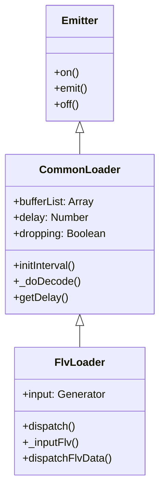

# CyperStream Demux 模块深度设计文档

本文档针对 `src/core/demux/` 目录下的核心解封装模块进行深度解析，重点阐述 `CommonLoader` 的缓冲控制机制与 `FlvLoader` 的协议解析实现。

## 1. 模块类图与继承关系



- **CommonLoader**: 负责通用的“流媒体特性”管理，如缓冲队列、时间戳同步、丢帧策略、解码器分发。它不关心具体容器格式（FLV/MP4）。
- **FlvLoader**: 负责具体的“容器格式”解析，将二进制流转换为一个个独立的 Tag（音视频帧），然后交给父类处理。

---

## 2. CommonLoader 核心机制详解
**文件路径**: [`src/core/demux/commonLoader.js`](src/core/demux/commonLoader.js)

### 2.1 缓冲区消费循环 (The Consumption Loop)

`CommonLoader` 不仅仅是被动的接收数据，它拥有一个“心脏”——`initInterval` 方法中定义的 10ms 循环。

**核心流程：**
1.  **检查状态**: 播放器是否销毁？MSE 是否正在更新（防止 SourceBuffer 溢出）？
2.  **判断模式**:
    -   **正常模式**: 取出队首帧，计算延迟。如果延迟在阈值内，直接送解码。
    -   **追帧模式 (Dropping Mode)**: 只要缓冲区还有数据，且未追平延迟，就持续丢弃数据。

### 2.2 延迟计算算法 (Latency Calculation)

延迟的计算依赖于两个时间轴的对比：**本地系统时间轴** vs **视频流时间轴**。

```javascript
// 公式简化
localPassed = Date.now() - startTimestamp; // 现实世界过去了多久
streamPassed = currentFrameTS - firstFrameTS; // 视频里过去了多久

delay = localPassed - streamPassed;
```
- 如果 `delay > 0`，说明现实时间跑得比视频快，视频**滞后**了（直播延迟增加）。
- `CommonLoader` 会实时计算每一帧的 `delay`。

### 2.3 智能丢帧策略 (Smart Dropping Strategy)

为了保证低延迟（Low Latency），必须在延迟过大时主动丢包。

**触发条件**: `delay > opt.videoBuffer + opt.videoBufferDelay`
**执行逻辑**:
1.  **标记**: 设置 `this.dropping = true`。
2.  **音频保留**: 音频配置帧（Sequence Header）永远不丢，防止静音或解码错误。
3.  **视频丢弃**:
    -   **P/B 帧**: 直接丢弃。没有参考价值，解码器不需要它们也能工作（只要有后续 I 帧）。
    -   **I 帧 (关键帧)**: 
        -   遇到 I 帧时，再次检查 `delay`。
        -   如果 `delay` 已经恢复正常（`< videoBuffer`），停止丢帧，将该 I 帧送入解码器，画面瞬间“跳”到最新时刻。
        -   如果 `delay` 依然很大，继续丢弃（极端网络拥塞情况）。

### 2.4 解码路由分发 (Decoding Dispatch)

`_doDecode` 方法是连接 Demux 层与 Decoder 层的枢纽。它根据配置决定数据的去向：

| 配置组合 | 目标接收者 | 数据格式 | 适用场景 |
| :--- | :--- | :--- | :--- |
| `useWCS=true` | `webcodecsDecoder` | `EncodedVideoChunk` | 现代浏览器高性能硬解 |
| `useMSE=true` | `mseDecoder` | `Uint8Array` (Remuxed) | 兼容性好，标准 HTML5 播放 |
| 其他 (默认) | `decoderWorker` | `ArrayBuffer` | 软解 (WASM) 或 Offscreen 硬解 |

---

## 3. FlvLoader 协议解析实现
**文件路径**: [`src/core/demux/flvLoader.js`](src/core/demux/flvLoader.js)

### 3.1 基于 Generator 的有限状态机

传统解析器通常使用复杂的 `offset` 指针和大量的 `if-else` 嵌套来处理分包（Fragmentation）问题。`FlvLoader` 采用了 ES6 Generator (`function*`) 实现了优雅的流式解析。

**设计精髓**:
- `yield N`: 表示“我需要 N 个字节的数据才能继续”。
- 解析逻辑写成线性的同步代码，无需关心数据是否跨越了网络包边界。

**状态机流程 (`_inputFlv`)**:
1.  **握手**: `yield 9` 读取 FLV Header，验证 Signature。
2.  **循环**:
    -   `yield 15`: 读取 PreviousTagSize(4) + TagHeader(11)。
    -   解析 Tag Header，提取 `DataLength` 和 `Timestamp`。
    -   `yield DataLength`: 读取 Tag Body (Payload)。
    -   根据 `TagType` (8=Audio, 9=Video) 调用 `_doDecode`。

### 3.2 数据流驱动器 (The Driver)

`dispatchFlvData` 是一个高阶函数，它封装了 Generator 的驱动逻辑。

**处理网络分片 (Fragmentation)**:
- 网络层送来的 `chunk` 大小是不确定的。
- **Buffer 拼接**: 如果当前 `chunk` 不足以满足 Generator 的 `yield` 请求，驱动器会将数据暂存在内部闭包变量 `buffer` 中。
- **循环推进**: 一旦数据攒够了，调用 `input.next(data)` 恢复 Generator 执行，直到再次挂起。

### 3.3 增强型编码支持 (Enhanced RTMP)

随着 H.265 (HEVC) 的普及，标准 FLV 协议（只定义了 AVC）已不够用。`FlvLoader` 实现了 Adobe 的 Enhanced RTMP 规范。

- **标准 AVC**: 通过 `PacketType` (0/1) 区分 Header 和 Frame。
- **Enhanced HEVC**:
    - 检查 Flags 是否包含 `FRAME_HEADER_EX`。
    - 解析 `FourCC` (如 `hvc1`) 识别编码格式。
    - 处理 `PACKET_TYPE_EX` 扩展包头，正确提取 VPS/SPS/PPS。

---

## 4. 关键代码片段解析

### 丢帧判断逻辑 (`commonLoader.js`)

```javascript
// 当处于丢帧状态时
while (!data.isIFrame && this.bufferList.length) {
    // 疯狂消费缓冲区，直到找到 I 帧或缓冲区空
    data = this.bufferList.shift();
}

// 找到 I 帧后，最后一次确认延迟
if (data.isIFrame && this.getDelay(data.ts) <= videoBuffer) {
    this.dropping = false; // 追平了！恢复正常
    this._doDecoderDecode(data);
}
```

### 驱动器拼接逻辑 (`flvLoader.js`)

```javascript
// 如果有上次剩下的半截数据
if (buffer) {
    let combine = new Uint8Array(buffer.length + data.length);
    combine.set(buffer); // 拼接旧的
    combine.set(data, buffer.length); // 拼接新的
    data = combine;
    buffer = null;
}

// 只要数据够 Generator 吃，就一直喂
while (data.length >= need.value) {
    // ... input.next ...
}
```
