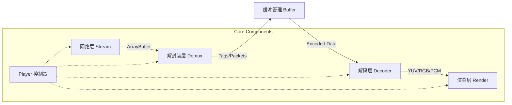

# CyperStream 技术架构说明文档

本文档详细描述了 CyperStream 播放器的核心架构、模块职责、数据流转机制及关键技术实现。

## 1. 系统架构概述 (System Architecture)

CyperStream 采用模块化分层架构，遵循 **单一职责原则**。核心链路设计为流式处理管道（Pipeline），数据从网络层获取后，经由解封装、解码、最后到达渲染层。

### 1.1 数据流转图 (Data Flow)



### 1.2 核心模块划分

| 模块 | 目录 | 职责描述 |
| :--- | :--- | :--- |
| **Core** | `src/core/Player.js` | 播放器的大脑，负责生命周期管理、配置解析、模块协调及对外 API 暴露。 |
| **Stream** | `src/core/stream/` | 负责网络连接建立与数据拉取。支持 Fetch (HTTP-FLV) 和 WebSocket 协议。 |
| **Demux** | `src/core/demux/` | 负责协议解析（如 FLV）。将连续的二进制流切分为独立的音视频 Tag/Packet。 |
| **Decoder** | `src/core/decoder/` & `worker/` | 负责视频/音频解码。支持软解（WASM/Worker）和硬解（WebCodecs/MSE）。 |
| **Render** | `src/core/video/` & `audio/` | 负责最终画面的绘制（Canvas/WebGL）和音频的播放（AudioContext）。 |

---

## 2. 核心模块详解 (Core Modules Detail)

### 2.1 Player 控制器 (The Brain)
- **文件**: `src/core/Player.js`
- **功能**:
  - **初始化**: 解析用户配置 (`opt`)，实例化各子模块（Loader, Demuxer, Decoder）。
  - **状态管理**: 维护 `playing`, `loading`, `destroyed` 等状态。
  - **事件总线**: 集成 `Emitter`，提供 `on`, `emit`, `off` 方法，实现模块间解耦通信。
  - **自动恢复**: 内置 `checkLoadingTimeout` 机制，在加载超时或卡顿时尝试重连或报错。

### 2.2 Stream 流加载器 (Network Layer)
- **文件**: `src/core/stream/fetchLoader.js` (HTTP-FLV), `websocketLoader.js` (WS-FLV)
- **机制**:
  - 使用 `fetch` API 的 `ReadableStream` 或 `WebSocket` 进行流式数据读取。
  - 这里的关键是 **Pump 机制**：不断从 reader 中读取 chunk，一旦获取数据立即通过 `demux.dispatch(chunk)` 派发给解封装层，不进行大量缓存，保证低延迟。

### 2.3 Demux 解封装与缓冲 (Parsing Layer)
- **核心文件**: `src/core/demux/commonLoader.js`, `flvLoader.js`
- **FlvLoader (`flvLoader.js`)**:
  - 实现了 FLV 协议的有限状态机（State Machine）。
  - 解析 FLV Header -> Tag Header -> Video/Audio Data。
  - 区分 H.264 (AVC) 和 H.265 (HEVC) 编码格式。
- **CommonLoader (`commonLoader.js`)**:
  - **缓冲区管理**: 维护 `_videoBufferList` 和 `_audioBufferList`。
  - **追帧策略 (Catch-up Mechanism)**: 
    - 核心函数 `initInterval` 定时检查缓冲区。
    - 计算 `delay` (当前时间 - 视频时间戳)。
    - 如果 `delay > videoBuffer` (配置阈值)，则触发 **丢帧逻辑**，丢弃非关键帧（Non-Keyframes），快速追赶最新画面，确保低延迟直播体验。
  - **解码路由**: 根据配置 (`useWCS`, `useMSE`, `useWorker`) 将数据分发给不同的解码器。

### 2.4 Decoder 解码器 (Decoding Layer)
- **核心文件**: `src/core/worker/decoder.worker.js`
- **工作模式**:
  - 为了避免阻塞主线程（UI 线程），繁重的解码任务通常在 Web Worker 中运行。
  - 接收 Demux 层传来的 Encoded Data。
  - 输出解码后的 ImageBitmap 或 YUV 数据。
  - **WebCodecs 集成**: 优先尝试使用浏览器原生的 `VideoDecoder` 进行硬件解码，性能极佳。

### 2.5 Renderer 渲染器 (Presentation Layer)
- **核心文件**: `src/core/video/canvasLoader.js`
- **功能**:
  - 接收解码后的帧数据 (`ImageBitmap`, `VideoFrame`)。
  - **多模式渲染**:
    - **WebGL**: 高性能渲染，支持 YUV->RGB 转换，适合软解输出。
    - **Canvas 2D**: 兼容性好，适合简单的图像绘制。
    - **OffscreenCanvas**: 支持在 Worker 中直接渲染，进一步释放主线程压力。

---

## 3. 关键技术机制 (Key Mechanisms)

### 3.1 追帧与低延迟策略 (Low Latency Strategy)
直播场景下，累积延迟是核心痛点。CyperStream 采用主动丢帧策略：
1. **监控**: 实时计算 `Buffer Length` 和 `Presentation Timestamp (PTS)` 滞后量。
2. **决策**: 当滞后量超过 `opt.videoBuffer` (如 1秒) 时，启动追帧。
3. **执行**: 
   - 丢弃缓冲区中所有的 **B帧** 和 **P帧**。
   - 只保留 **I帧** (关键帧)，确保解码器能正确恢复图像，实现“跳跃式”追帧。

### 3.2 Worker 通信与零拷贝 (Zero-Copy)
- 主线程与 Worker 之间的数据传输量巨大（尤其是 4K 视频）。
- CyperStream 利用 `Transferable Objects` (如 `ArrayBuffer`, `ImageBitmap`) 进行消息传递。
- **优势**: 数据所有权转移而非复制，传输耗时几乎为零，极大降低了 CPU 和 内存开销。

### 3.3 观察者模式 (Observer Pattern)
- **文件**: `src/core/player/observer.js`
- **作用**: 劫持/代理 Player 的公共方法（如 `play`, `pause`）。
- **目的**: 在实际执行操作前，可以插入日志记录、状态检查、统计上报等逻辑，实现 AOP (面向切面编程) 的效果，增强了系统的可扩展性和调试能力。

---

## 4. 目录结构说明 (Directory Structure)

```text
src/
├── core/
│   ├── Player.js           # 核心入口类
│   ├── stream/             # 网络流加载 (Fetch, WebSocket)
│   ├── demux/              # 协议解封装 (FLV, Buffer管理)
│   ├── decoder/            # 解码逻辑封装
│   ├── video/              # 视频渲染 (Canvas, WebGL)
│   ├── audio/              # 音频处理 (AudioContext)
│   ├── worker/             # Web Worker 相关 (解码线程)
│   ├── player/             # 辅助模块 (Observer, Events, Property)
│   └── control/            # UI 控件逻辑
├── utils/                  # 通用工具 (Emitter, Debug, Logger)
└── index.js                # 库导出入口
```

## 5. 开发与扩展指南

- **添加新协议**: 在 `src/core/demux/` 下实现新的 Loader (如 `hlsLoader.js`)，并遵循 `dispatch` 接口规范。
- **自定义渲染**: 修改 `src/core/video/` 下的 Loader，接入新的渲染库（如 Three.js）。
- **调试模式**: 开启 `opt.debug = true`，利用 `src/utils/debug.js` 输出详细的 Pipeline 日志。
